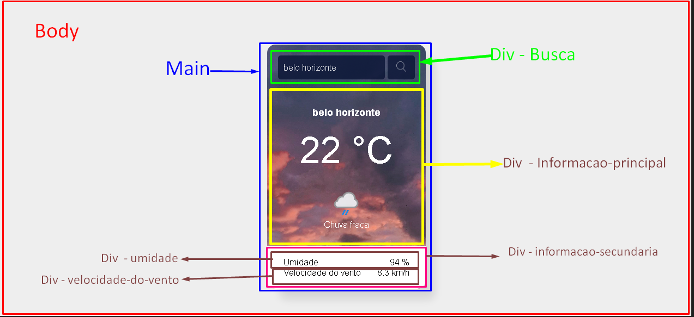

# app-Previsao-do-Tempo
- Elaborar um app  onde o usuário possa ter  informações a repeito do Clima  de uma localidade.
Ferramentas Utilizadas Linguagem de Marcação (HTML), Estilização(CSS), Linguagem de programaçao Javascript e Api da Weatherapi.

## Etapa
1 - montar um layout.

2 - Executar o VsCode. 

3 - Criar o arquivo Html. 

4 - Montar a estrutura Organizacional das pastas.

  
5 - Links
- Link dos arquivos de imagem:
https://drive.google.com/drive/folder...

- Link da tag img:   
https://cdn.weatherapi.com/weather/64...

- API que usamos na aula:
https://www.weatherapi.com/

- Site que usamos pro box shadow 
https://box-shadow.dev/

- Site com imagens de graça
https://www.pexels.com/

