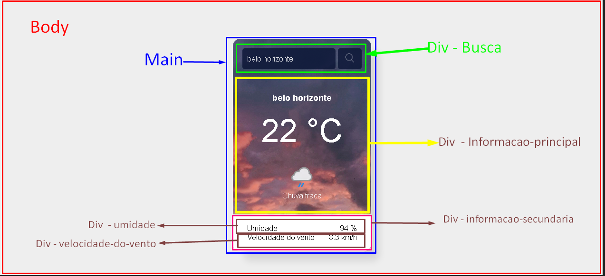

# app-Previsao-do-Tempo
- Elaborar um app  onde o usuário possa ter  informações a repeito do Clima  de uma localidade.
Ferramentas Utilizadas Linguagem de Marcação (HTML), Estilização(CSS), Linguagem de programaçao Javascript e Api da Weatherapi.

## Etapa
1 - montar um layout.

2 - Executar o VsCode. 

3 - Criar o arquivo Html. 

4 - Montar a estrutura Organizacional das pastas.

  
5 - Links
- Link dos arquivos de imagem:
https://www.youtube.com/redirect?event=video_description&redir_token=QUFFLUhqay04RnFPeXF1eHVfT09fTk9fd0txR0pCV3NRZ3xBQ3Jtc0tuM0lRU25xM1RTaEdIU1hWVjNSaGdqYmN3bUpYNjFNakhNSGhKMFdzUi1LUHltSTA1WEZUaUJmM1hoQl9QMnBscUxiYTRsSG4xbDJVLVRIQ0MzZXhjdmg4TzV4ZUstcUcxWGtIUnNtX2FPZlJaUnJybw&q=https%3A%2F%2Fdrive.google.com%2Fdrive%2Ffolders%2F1k9D9bovB7iW3hoIgeJBE2Ybh5q5CJCeE&v=xTJ1XMhSk34
- Link da tag img:  https://cdn.weatherapi.com/weather/64...

- API que usamos na aula: https://www.weatherapi.com/

- Site que usamos pro box shadow  https://box-shadow.dev/

- Site com imagens de graça: https://www.pexels.com/

